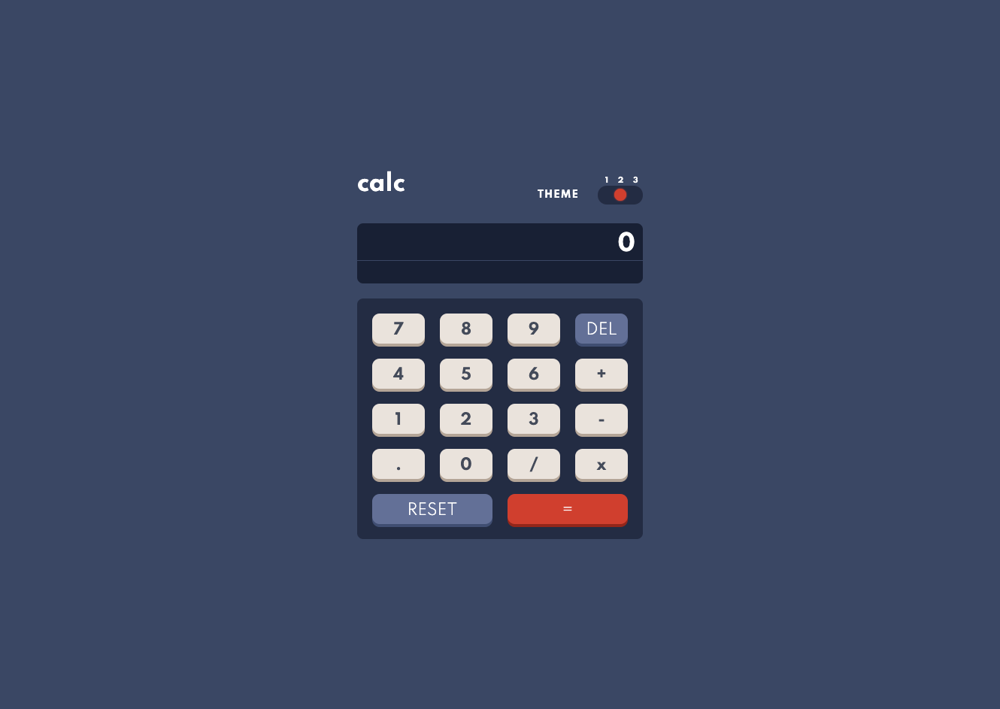
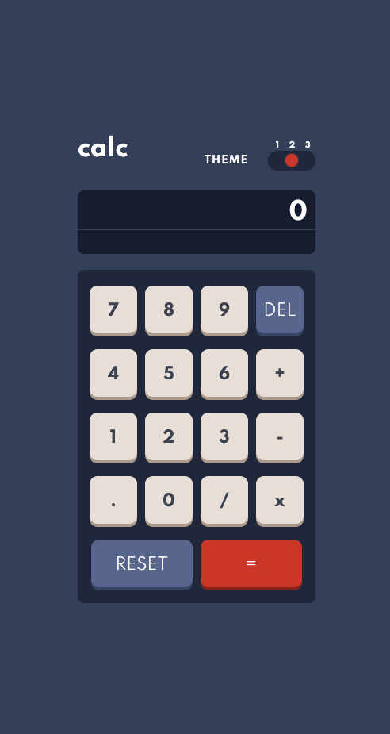

    

<h1 id="calc">🧮 Calculator app</h1>

This is a Calculator app for Goblant Bootcamp
The resources used here are from [Calculator App](https://www.frontendmentor.io/challenges/calculator-app-9lteq5N29) in Frontend Mentor.

You can see the live preview → [Calculator app](http://calc.alexcamachogz.com/).

## Table of contents

- [Calculator app](#calc)
- [Available Scripts](#scripts)
- [Preview](#preview)
  - [Desktop](#desktop)
  - [Mobile](#mobile)
- [Technologies](#technologies)
- [Author](#author)

<h2 id="scripts">🔥 Available Scripts</h2>
Not dependencies are required for this project.

<h2 id="preview">🔍 Preview</h2>

  
🖥 Desktop version
    
  

  
📱 Mobile version
  
  

<h2 id="technologies">📌 Technologies</h2>

1. Semantic HTML
2. Vanilla CSS
3. Vanilla JavaScript
4. Transitions

<h2 id="author">🌟 Author</h2>

**Alejandra Camacho** - [@alexcamachogz](https://github.com/alexcamachogz)